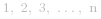
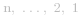
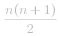
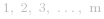
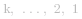
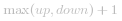
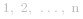

#### 方法 1：暴力

**算法**

最简单的方法是使用一个一维的数组 *candies* 去记录给学生的糖果数。首先我们给每个学生 1 个糖果。然后我们开始从左到右扫描数组。对每一个学生，如果当前的评分 *ratings[i]* 比前一名学生的评分 *ratings[i - 1]* 高，且 *candies[i]<=candies[i - 1]* ，那么我们更新 *candies[i] = candies[i-1] + 1*。这样，这两名学生之间的糖果分配目前是正确的。同样的，我们检查当前学生的评分 *ratings[i]* 是否比 *ratings[i+1]* 高，如果成立，我们同样更新 *candies[i]=candies[i+1] + 1* 。我们继续对 *ratings* 数组重复此步骤。如果在某次遍历中， *candies* 数组不再变化，意味着我们已经得到了最后的糖果分布，此时可以停止遍历。为了记录是否到达最终状态，我们用 *flag* 记录每次遍历是否有糖果数目变化，如果有，则为   ，否则为   。

最终，我们可以把 *candies* 数组中所有糖果数目加起来，得到要求数目最少的糖果数。

```Java []
public class Solution {
    public int candy(int[] ratings) {
        int[] candies = new int[ratings.length];
        Arrays.fill(candies, 1);
        boolean flag = true;
        int sum = 0;
        while (flag) {
            flag = false;
            for (int i = 0; i < ratings.length; i++) {
                if (i != ratings.length - 1 && ratings[i] > ratings[i + 1] && candies[i] <= candies[i + 1]) {
                    candies[i] = candies[i + 1] + 1;
                    flag = true;
                }
                if (i > 0 && ratings[i] > ratings[i - 1] && candies[i] <= candies[i - 1]) {
                    candies[i] = candies[i - 1] + 1;
                    flag = true;
                }
            }
        }
        for (int candy : candies) {
            sum += candy;
        }
        return sum;
    }
}
```

**复杂度分析**

* 时间复杂度：*O(n^2)* 。对于每个元素，我们最多要遍历 *n* 次。

* 空间复杂度： *O(n)* 。需要一个长度为 *n* 的 *candies* 数组。
<br>
<br>
<br>
#### 方法 2：用两个数组

**算法**

在这种方法中，我们使用两个一维数组 *left2right* 和 *right2left* 。数组 *left2right* 用来存储每名学生只与左边邻居有关的所需糖果数。也就是假设规则为：如果一名学生评分比他左边学生高，那么他应该比他左边学生得到更多糖果。类似的，*right2left* 数组用来保存只与右边邻居有关的所需糖果数。也就是假设规则为：如果一名学生评分比他右边学生高，那么他应该比他右边学生得到更多糖果。

首先，我们在 *left2rigth* 和 *right2left* 中，给每个学生 1 个糖果。然后，我们从左向右遍历整个数组，只要当前学生评分比他左邻居高，我们在 *left2right* 数组中更新当前学生的糖果数 *left2right[i] = left2right[i-1] + 1*，这是因为在每次更新前，当前学生的糖果数一定小于等于他左邻居的糖果数。

在从左到右扫描后，我们用同样的方法从右到左只要当前学生的评分比他右边（第 *(i+1)* 个）学生高，就更新 *right2left[i]* 为 *right2left[i] = right2left[i + 1] + 1* 。

现在，对于数组中第 *i* 个学生，为了满足题中条件，我们需要给他 ![\text{max}(left2right\[i\],right2left\[i\]) ](./p__text{max}_left2right_i_,_right2left_i___.png)  个糖果。因此，最后我们得到最少糖果数：

![minimum\_candies=\sum_{i=0}^{n-1}\text{max}(left2right\[i\],right2left\[i\]) ](./p___minimum_candies=sum_{i=0}^{n-1}_text{max}_left2right_i_,_right2left_i____.png) 

其中， *n* 是评分数组的长度。


```Java []
public class Solution {
    public int candy(int[] ratings) {
        int sum = 0;
        int[] left2right = new int[ratings.length];
        int[] right2left = new int[ratings.length];
        Arrays.fill(left2right, 1);
        Arrays.fill(right2left, 1);
        for (int i = 1; i < ratings.length; i++) {
            if (ratings[i] > ratings[i - 1]) {
                left2right[i] = left2right[i - 1] + 1;
            }
        }
        for (int i = ratings.length - 2; i >= 0; i--) {
            if (ratings[i] > ratings[i + 1]) {
                right2left[i] = right2left[i + 1] + 1;
            }
        }
        for (int i = 0; i < ratings.length; i++) {
            sum += Math.max(left2right[i], right2left[i]);
        }
        return sum;
    }
}
```

**复杂度分析**

* 时间复杂度：*O(n)*。 *left2right* 和 *right2left* 会各更新一次。

* 空间复杂度：*O(n)*。 两个数组 *left2right* 和 *right2left* 大小都为 *n* 。
<br>
<br>
<br>

#### 方法 3：使用一个数组

**算法**

在前面的方法中，我们使用了两个数组分别记录每一个学生与他左邻居和右邻居的关系，后来再将两个数组合并。在这里我们可以只用一个数组 *candies* ，记录当前学生被分配的糖果数。

首先我们给每个学生 1 个糖果，然后我们从左到右遍历并分配糖果，我们仅更新评分比左邻居高且糖果数小于等于左邻居的学生，将其更新为 *candies[i] = candies[i-1] + 1*。在更新的过程中，我们不需要比较 *candies[i]* 和 *candies[i - 1]* ，因为在更新前一定有 ![candies\[i\]\leqcandies\[i-1\] ](./p__candies_i__leq_candies_i_-_1__.png)  。

从左到右遍历完后，我们同样地从右到左遍历。现在我们需要更新每个学生 *i* 同时满足左邻居和右邻居的关系。在这次遍历汇总，如果 *ratings[i]>ratings[i + 1]* ，仅考虑右邻居规则的情况下，我们本应该更新为 *candies[i] = candies[i + 1] + 1* ，但是这次我们仅当 ![candies\[i\]\leqcandies\[i+1\] ](./p__candies_i__leq_candies_i_+_1__.png)  才更新。这是因为我们在从左到右遍历的时候已经修改过 *candies* 数组，所以 *candies[i]* 不一定小于等于 *candies[i + 1]*。所以，如果 *ratings[i] > ratings[i + 1]* ，我们更新为 ![candies\[i\]=\text{max}(candies\[i\],candies\[i+1\]+1\]) ](./p__candies_i__=_text{max}_candies_i_,_candies_i_+_1__+_1___.png)  ，这样 *candies[i]* 同时满足左邻居和右邻居的约束。

再一次，我们把 *candies* 数组中的所有元素求和，获得所需结果。

![minimum_candies=\sum_{i=0}^{n-1}candies\[i\] ](./p___minimum_candies_=_sum_{i=0}^{n-1}_candies_i___.png) 

其中， *n* 是评分数组的长度。

```Java []
public class Solution {
    public int candy(int[] ratings) {
        int[] candies = new int[ratings.length];
        Arrays.fill(candies, 1);
        for (int i = 1; i < ratings.length; i++) {
            if (ratings[i] > ratings[i - 1]) {
                candies[i] = candies[i - 1] + 1;
            }
        }
        int sum = candies[ratings.length - 1];
        for (int i = ratings.length - 2; i >= 0; i--) {
            if (ratings[i] > ratings[i + 1]) {
                candies[i] = Math.max(candies[i], candies[i + 1] + 1);
            }
            sum += candies[i];
        }
        return sum;
    }
}
```

**复杂度分析**

* 时间复杂度：*O(n)* 。长度为 *n* 数组 *candies* 被遍历了 3 次。

* 空间复杂度：*O(n)* 。数组 *candies* 长度为 *n* 。
<br>
<br>
<br>

#### 方法 4：常数空间一次遍历

**算法**

这个方法通过观察（如下面的图所展示）发现，为了获得最少总数的糖果，糖果的分配每次都是增加 1 的。进一步的，在分配糖果时，给一个学生的最少数目是 1 。所以，局部的分配形式一定是   或者  ，总和是   。

现在我们可以把评分数组 *ratings* 当做一些上升和下降的坡。每当坡是上升的，糖果的分配一定是   这样的。同样的，如果是一个下降的坡，一定是   的形式。一个随之而来的情况是，每个峰都只会在这些坡中的一个出现。那么我们应该把这个峰放在上升的坡中还是下降的坡中呢？

为了解决这个问题，我们观察到为了同时满足左右邻居的约束，峰值一定是上升的坡和下降的坡中所有点的最大值，所以为了决定需要的糖果数，峰点需要算在上升坡和下降坡较多点的那一边。局部谷点也只能被包括在一个坡中，但是这种情况很容易解决，因为局部谷点总是只会被分配 1 个糖果（可以在下一个坡开始计数时减去）。

接下来考虑实现，我们维护两个变量   和   来决定现在是在峰还是在谷，同时我们用 *up* 和 *down* 两个变量分别记录上升或者下降坡中的学生个数（不包括峰点）。我们总是在一个下降的坡接着上升坡（或者上升坡接一个下降坡）的时候更新 *candies* 的总数。

在一个山的结束处，我们决定将峰点算在上升坡还是下降坡中，决定的依据是比较 *up* 和 *down* 两个变量。因此，峰值的数目应该为  。此时，我们将 *up* 和 *down* 变量重新初始化，表示一个新的山的开始。

下面的图展示了如下样例的结果。

` rankings: [1 2 3 4 5 3 2 1 2 6 5 4 3 3 2 1 1 3 3 3 4 2] `


从这个图中，我们可以看到糖果在局部的分配中一定是   或者   这样的形式。对于由 *a* 和 *b* 组成的第一座山，在分配峰点（*pt. 5*）糖果的时候，它应该被分配到 *a* 中满足左邻居约束，*b* 中的局部谷点（*pt. 8*）标志着第一座山（*c*）的结束。在计算的时候，我们可以把这个点归属为当前的山，也可以归属到接下来的山中。点 *pt.13* 标记的是第二座山的结束，因为 *pt.13* 和 *pt.14* 两个学生的评分是相同的。因此，区域 *e* 比区域 *d* 有更多的点，局部峰点 (*pt. 10*）应该被划分到 *e* 区域满足右邻居的约束。现在第三座山 *f* 应该被考虑为一座只有下降坡没有上升坡的山 (*up=0*）。类似的，因为与旁边的学生评分相同， *pt.16, 18, 19* 也是山的结束。


```Java []
public class Solution {
    public int count(int n) {
        return (n * (n + 1)) / 2;
    }
    public int candy(int[] ratings) {
        if (ratings.length <= 1) {
            return ratings.length;
        }
        int candies = 0;
        int up = 0;
        int down = 0;
        int old_slope = 0;
        for (int i = 1; i < ratings.length; i++) {
            int new_slope = (ratings[i] > ratings[i - 1]) ? 1 : (ratings[i] < ratings[i - 1] ? -1 : 0);
            if ((old_slope > 0 && new_slope == 0) || (old_slope < 0 && new_slope >= 0)) {
                candies += count(up) + count(down) + Math.max(up, down);
                up = 0;
                down = 0;
            }
            if (new_slope > 0)
                up++;
            if (new_slope < 0)
                down++;
            if (new_slope == 0)
                candies++;

            old_slope = new_slope;
        }
        candies += count(up) + count(down) + Math.max(up, down) + 1;
        return candies;
    }
}
```

**复杂度分析**

* 时间复杂度：*O(n)* 。我们遍历 *ratings* 数组一次。

* 空间复杂度：*O(1)* 。使用了常数个变量的额外空间。