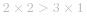
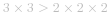

#### 方法一：动态规划

对于的正整数 *n*，当   时，可以拆分成至少两个正整数的和。令 *k* 是拆分出的第一个正整数，则剩下的部分是 *n-k*，*n-k* 可以不继续拆分，或者继续拆分成至少两个正整数的和。由于每个正整数对应的最大乘积取决于比它小的正整数对应的最大乘积，因此可以使用动态规划求解。

创建数组  ，其中 ![\text{dp}\[i\] ](./p__text{dp}_i__.png)  表示将正整数 *i* 拆分成至少两个正整数的和之后，这些正整数的最大乘积。特别地，*0* 不是正整数，*1* 是最小的正整数，*0* 和 *1* 都不能拆分，因此 ![\text{dp}\[0\]=\text{dp}\[1\]=0 ](./p__text{dp}_0_=text{dp}_1_=0_.png) 。

当   时，假设对正整数 *i* 拆分出的第一个正整数是 *j*（ ），则有以下两种方案：

- 将 *i* 拆分成 *j* 和 *i-j* 的和，且 *i-j* 不再拆分成多个正整数，此时的乘积是  ；

- 将 *i* 拆分成 *j* 和 *i-j* 的和，且 *i-j* 继续拆分成多个正整数，此时的乘积是 ![j\times\text{dp}\[i-j\] ](./p__j_times_text{dp}_i-j__.png) 。

因此，当 *j* 固定时，有 ![\text{dp}\[i\]=\max(j\times(i-j),j\times\text{dp}\[i-j\]) ](./p__text{dp}_i_=max_j_times__i-j_,_j_times_text{dp}_i-j___.png) 。由于 *j* 的取值范围是 *1* 到 *i-1*，需要遍历所有的 *j* 得到 ![\text{dp}\[i\] ](./p__text{dp}_i__.png)  的最大值，因此可以得到状态转移方程如下：

![\text{dp}\[i\]=\mathop{\max}\limits_{1\lej<i}\{\max(j\times(i-j),j\times\text{dp}\[i-j\])\} ](./p___text{dp}_i_=mathop{max}limits_{1_le_j___i}{max_j_times__i-j_,_j_times_text{dp}_i-j__}__.png) 

最终得到 ![\text{dp}\[n\] ](./p__text{dp}_n__.png)  的值即为将正整数 *n* 拆分成至少两个正整数的和之后，这些正整数的最大乘积。

```Java [sol1-Java]
class Solution {
    public int integerBreak(int n) {
        int[] dp = new int[n + 1];
        for (int i = 2; i <= n; i++) {
            int curMax = 0;
            for (int j = 1; j < i; j++) {
                curMax = Math.max(curMax, Math.max(j * (i - j), j * dp[i - j]));
            }
            dp[i] = curMax;
        }
        return dp[n];
    }
}
```

```cpp [sol1-C++]
class Solution {
public:
    int integerBreak(int n) {
        vector <int> dp(n + 1);
        for (int i = 2; i <= n; i++) {
            int curMax = 0;
            for (int j = 1; j < i; j++) {
                curMax = max(curMax, max(j * (i - j), j * dp[i - j]));
            }
            dp[i] = curMax;
        }
        return dp[n];
    }
};
```

```Python [sol1-Python3]
class Solution:
    def integerBreak(self, n: int) -> int:
        dp = [0] * (n + 1)
        for i in range(2, n + 1):
            for j in range(i):
                dp[i] = max(dp[i], j * (i - j), j * dp[i - j])
        return dp[n]
```

```golang [sol1-Golang]
func integerBreak(n int) int {
    dp := make([]int, n + 1)
    for i := 2; i <= n; i++ {
        curMax := 0
        for j := 1; j < i; j++ {
            curMax = max(curMax, max(j * (i - j), j * dp[i - j]))
        }
        dp[i] = curMax
    }
    return dp[n]
}

func max(x, y int) int {
    if x > y {
        return x
    }
    return y
}
```

```C [sol1-C]
int integerBreak(int n) {
    int dp[n + 1];
    memset(dp, 0, sizeof(dp));
    for (int i = 2; i <= n; i++) {
        int curMax = 0;
        for (int j = 1; j < i; j++) {
            curMax = fmax(curMax, fmax(j * (i - j), j * dp[i - j]));
        }
        dp[i] = curMax;
    }
    return dp[n];
}
```

**复杂度分析**

- 时间复杂度：*O(n^2)*，其中 *n* 是给定的正整数。对于从 *2* 到 *n* 的每一个整数都要计算对应的   值，计算一个整数对应的   值需要 *O(n)* 的时间复杂度，因此总时间复杂度是 *O(n^2)*。

- 空间复杂度：*O(n)*，其中 *n* 是给定的正整数。创建一个数组  ，其长度为 *n+1*。

#### 方法二：优化的动态规划

方法一中定义的状态转移方程如下：

![\text{dp}\[i\]=\mathop{\max}\limits_{1\lej<i}\{\max(j\times(i-j),j\times\text{dp}\[i-j\])\} ](./p___text{dp}_i_=mathop{max}limits_{1_le_j___i}{max_j_times__i-j_,_j_times_text{dp}_i-j__}__.png) 

使用上述状态转移方程，计算 ![\text{dp}\[i\] ](./p__text{dp}_i__.png)  时，*j* 的值遍历了从 *1* 到 *i-1* 的所有值，因此总时间复杂度是 *O(n^2)*。是否可以降低时间复杂度？

上述状态转移方程包含两项，当 *j* 固定时，![\text{dp}\[i\] ](./p__text{dp}_i__.png)  的值由   和 ![j\times\text{dp}\[i-j\] ](./p__j_times_text{dp}_i-j__.png)  中的较大值决定，因此需要对两项分别考虑。

首先考虑 ![j\times\text{dp}\[i-j\] ](./p__j_times_text{dp}_i-j__.png)  这一项。

注意到   的定义，![\text{dp}\[i\] ](./p__text{dp}_i__.png)  表示将正整数 *i* 拆分成至少两个正整数的和之后，这些正整数的最大乘积，因此对于任意  ，有 ![\text{dp}\[i\]\gej\times\text{dp}\[i-j\] ](./p__text{dp}_i__ge_j_times_text{dp}_i-j__.png) 。

当 *j* 是奇数时，有  ，因此 ![\text{dp}\[i\]\geq\frac{j-1}{2}\times\text{dp}\[i-\frac{j-1}{2}\]\ge\frac{j-1}{2}\times\frac{j+1}{2}\times\text{dp}\[i-j\] ](./p__text{dp}_i__geq_frac{j-1}{2}_times_text{dp}_i_-_frac{j-1}{2}___ge_frac{j-1}{2}_times_frac{j+1}{2}_times_text{dp}_i-j__.png) 。

当 *j* 是偶数时，有  ，因此 ![\text{dp}\[i\]\ge\frac{j}{2}\times\text{dp}\[i-\frac{j}{2}\]\ge\frac{j}{2}\times\frac{j}{2}\times\text{dp}\[i-j\] ](./p__text{dp}_i__ge_frac{j}{2}_times_text{dp}_i_-_frac{j}{2}__ge_frac{j}{2}_times_frac{j}{2}_times_text{dp}_i-j__.png) 。

如果   且 *j* 是奇数，则   恒成立。如果   且 *j* 是偶数，则   恒成立，当且仅当 *j=4* 时等号成立。

由此可知，如果  ，则 ![\text{dp}\[j\]\gej ](./p__text{dp}_j__ge_j_.png) ，当且仅当 *j=4* 时等号成立，即当   时一定能将 *j* 拆成至少两个正整数的和，这些正整数的乘积大于或等于 *j*。

同时也可以得到，如果  ，则 ![\text{dp}\[i\]\gej\times\text{dp}\[i-j\] ](./p__text{dp}_i__ge_j_times_text{dp}_i-j__.png) ，只有当 *j=4* 时等号可能成立。又由于

![\text{dp}\[i\]\ge2\times\text{dp}\[i-2\]\ge2\times(2\times\text{dp}\[i-4\])=4\times\text{dp}\[i-4\] ](./p___text{dp}_i__ge_2_times_text{dp}_i-2__ge_2_times__2_times_text{dp}_i-4___=_4_times_text{dp}_i-4___.png) 

因此取 *j=2* 计算得到的 ![\text{dp}\[i\] ](./p__text{dp}_i__.png)  一定不会小于取 *j=4* 计算得到的 ![\text{dp}\[i\] ](./p__text{dp}_i__.png) 。根据上述分析，  的情况都是不需要考虑的。

那么 *j=1* 是否需要考虑？答案是不需要。如果取 *j=1*，则有 ![\text{dp}\[i\]\ge1\times\text{dp}\[i-1\]=\text{dp}\[i-1\] ](./p__text{dp}_i__ge_1_times_text{dp}_i-1_=text{dp}_i-1__.png) 。当   时，![\text{dp}\[i-1\] ](./p__text{dp}_i-1__.png)  是将正整数 *i-1* 拆分成至少两个正整数的和之后，这些正整数的最大乘积，在拆分成的正整数中，任选一个数字加 *1*，则拆分成的正整数的和变成 *i*，且乘积一定大于 ![\text{dp}\[i-1\] ](./p__text{dp}_i-1__.png) ，因此必有 ![\text{dp}\[i\]>\text{dp}\[i-1\] ](./p__text{dp}_i__text{dp}_i-1__.png) ，即当 *j=1* 时不可能得到最大的 ![\text{dp}\[i\] ](./p__text{dp}_i__.png)  的值。

根据上述分析可知，计算 ![\text{dp}\[i\] ](./p__text{dp}_i__.png)  的值只需要考虑 *j=2* 和 *j=3* 的情况，不需要遍历从 *1* 到 *i-1* 的所有值。

其次考虑   这一项。

根据上述推导可知，如果  ，则 ![\text{dp}\[j\]\gej ](./p__text{dp}_j__ge_j_.png) ，当且仅当 *j=4* 时等号成立。因此在   的情况下，有 ![\text{dp}\[i-j\]\gei-j ](./p__text{dp}_i-j__ge_i-j_.png) ，![\text{dp}\[i\]\gej\times\text{dp}\[i-j\]\gej\times(i-j) ](./p__text{dp}_i__ge_j_times_text{dp}_i-j__ge_j_times__i-j__.png) ，此时计算 ![\text{dp}\[i\] ](./p__text{dp}_i__.png)  的值不需要考虑   的值。

如果 *i-j<4*，在计算 ![\text{dp}\[i\] ](./p__text{dp}_i__.png)  的值的时候就需要考虑   的值。在考虑 ![j\times\text{dp}\[i-j\] ](./p__j_times_text{dp}_i-j__.png)  时，根据上述分析，只需要考虑 *j=2* 和 *j=3* 的情况。在考虑   时，需要考虑 *j* 的哪些值？

如果 *j=1*，则  ，当 *i=2* 或 *i=3* 时有 ![\text{dp}\[i\]=i-1 ](./p__text{dp}_i_=i-1_.png) ，当   时有 ![\text{dp}\[i\]\gei>i-1 ](./p__text{dp}_i__ge_i_i-1_.png) ，显然当   时取 *j=1* 不可能得到最大乘积，因此 *j=1* 时是不需要考虑的。

如果  ，![\text{dp}\[i\] ](./p__text{dp}_i__.png)  是否可能等于  ？当 *i* 固定时，要使得   的值最大，*j* 的值应该取 *j=i/2*，这里的 */* 表示整数除法。当   时，若要满足 *j=i/2*，则  ，此时  ，利用上述结论，![\text{dp}\[i-j\]\gei-j ](./p__text{dp}_i-j__ge_i-j_.png) ，因此 ![j\times\text{dp}\[i-j\]\gej\times(i-j) ](./p__j_times_text{dp}_i-j__ge_j_times__i-j__.png) 。由此可见，当   时，计算 ![\text{dp}\[i\] ](./p__text{dp}_i__.png)  只需要考虑 ![j\times\text{dp}\[i-j\] ](./p__j_times_text{dp}_i-j__.png) ，不需要考虑  。

又由于在使用 ![j\times\text{dp}\[i-j\] ](./p__j_times_text{dp}_i-j__.png)  计算 ![\text{dp}\[i\] ](./p__text{dp}_i__.png)  时，*j=2* 和 *j=3* 的情况一定优于   的情况，因此无论是考虑 ![j\times\text{dp}\[i-j\] ](./p__j_times_text{dp}_i-j__.png)  还是考虑  ，都只需要考虑 *j=2* 和 *j=3* 的情况。

由此可以对方法一的动态规划进行优化。

边界情况是 *n=2*，此时唯一的拆分方案是 *2=1+1*，最大乘积是  。

当   时，状态转移方程如下：

![\text{dp}\[i\]=\max(2\times(i-2),2\times\text{dp}\[i-2\],3\times(i-3),3\times\text{dp}\[i-3\]) ](./p___text{dp}_i_=max_2_times__i-2_,_2_times_text{dp}_i-2_,_3_times__i-3_,_3_times_text{dp}_i-3____.png) 

```Java [sol2-Java]
class Solution {
    public int integerBreak(int n) {
        if (n < 4) {
            return n - 1;
        }
        int[] dp = new int[n + 1];
        dp[2] = 1;
        for (int i = 3; i <= n; i++) {
            dp[i] = Math.max(Math.max(2 * (i - 2), 2 * dp[i - 2]), Math.max(3 * (i - 3), 3 * dp[i - 3]));
        }
        return dp[n];
    }
}
```

```cpp [sol2-C++]
class Solution {
public:
    int integerBreak(int n) {
        if (n < 4) {
            return n - 1;
        }
        vector <int> dp(n + 1);
        dp[2] = 1;
        for (int i = 3; i <= n; i++) {
            dp[i] = max(max(2 * (i - 2), 2 * dp[i - 2]), max(3 * (i - 3), 3 * dp[i - 3]));
        }
        return dp[n];
    }
};
```

```Python [sol2-Python3]
class Solution:
    def integerBreak(self, n: int) -> int:
        if n < 4:
            return n - 1
        
        dp = [0] * (n + 1)
        dp[2] = 1
        for i in range(3, n + 1):
            dp[i] = max(2 * (i - 2), 2 * dp[i - 2], 3 * (i - 3), 3 * dp[i - 3])
        
        return dp[n]
```

```golang [sol2-Golang]
func integerBreak(n int) int {
    if n < 4 {
        return n - 1
    }
    dp := make([]int, n + 1)
    dp[2] = 1
    for i := 3; i <= n; i++ {
        dp[i] = max(max(2 * (i - 2), 2 * dp[i - 2]), max(3 * (i - 3), 3 * dp[i - 3]))
    }
    return dp[n]
}

func max(x, y int) int {
    if x > y {
        return x
    }
    return y
}
```

```C [sol2-C]
int integerBreak(int n) {
    if (n < 4) {
        return n - 1;
    }
    int dp[n + 1];
    memset(dp, 0, sizeof(dp));
    dp[2] = 1;
    for (int i = 3; i <= n; i++) {
        dp[i] = fmax(fmax(2 * (i - 2), 2 * dp[i - 2]), fmax(3 * (i - 3), 3 * dp[i - 3]));
    }
    return dp[n];
}
```

**复杂度分析**

- 时间复杂度：*O(n)*，其中 *n* 是给定的正整数。和方法一相比，计算每个整数对应的   的值的时间复杂度降到 *O(1)*，因此总时间复杂度降到 *O(n)*。

- 空间复杂度：*O(n)*，其中 *n* 是给定的正整数。创建一个数组  ，其长度为 *n+1*。

#### 方法三：数学

方法二中利用了数学知识降低时间复杂度。正整数 *4* 可以拆分成 *2+2*，乘积不变（ ）。对于大于 *4* 的正整数，总是存在一种拆分的方案，使得拆分成的两个正整数的乘积大于拆分前的正整数（例如，*5=2+3*， ）。那么，能否利用数学知识在方法二的基础上进一步降低时间复杂度，找到最优的拆分方案呢？

下面给出两种直接得出最优拆分方案的证明方法。

**函数极值证明法**

显然，如果将给定的正整数拆分成尽可能多的某个特定的正整数，则这些正整数的乘积最大。

定义函数 *f(x)* 表示将给定的正整数 *n* 拆分成尽可能多的正数 *x* 的情况下的最大乘积，则可以将 *n* 分成   项，此时  ，目标是求 *f(x)* 的最大值，即

 

可以将 *f(x)* 写成如下形式：

 

令 *g(t)=e^t*， ，则有  。由于 *g(t)* 是单调递增的，*n>0*，因此 *h(x)* 与 *f(x)* 的单调性相同。

计算 *h(x)* 的驻点，即   的点，得到驻点为 *x=e*。

由于当 *0<x<e* 时 *h'(x)>0*，当 *x>e* 时 *h'(x)<0*，因此 *x=e* 是 *h(x)* 的极大值点，也是 *f(x)* 的极大值点。由于函数 *f(x)* 的定义域连续，因此极大值点唯一，也是最大值点。

因此，当 *x=e* 时，*f(x)* 取到最大值， 。

由于 *e* 不是整数，因此使用与 *e* 最接近的整数作为 *x* 的值，*x* 可以是 *2* 或 *3*，此时需要比较 *f(2)* 与 *f(3)* 的大小，可以通过计算   进行比较。

 

由于  ，因此  ，即 *f(3)>f(2)*。当 *x=3* 时，可以得到最大乘积。因此，应该将给定的正整数拆分成尽可能多的 *3*。

根据 *n* 除以 *3* 的余数进行分类讨论：

- 如果余数为 *0*，即  ，则将 *n* 拆分成 *m* 个 *3*；

- 如果余数为 *1*，即  ，由于  ，因此将 *n* 拆分成 *m-1* 个 *3* 和 *2* 个 *2*；

- 如果余数为 *2*，即  ，则将 *n* 拆分成 *m* 个 *3* 和 *1* 个 *2*。

上述拆分的适用条件是  。如果  ，则上述拆分不适用，需要单独处理。

- 如果 *n=2*，则唯一的拆分方案是 *2=1+1*，最大乘积是  ；

- 如果 *n=3*，则拆分方案有 *3=1+2=1+1+1*，最大乘积对应方案 *3=1+2*，最大乘积是  。

这两种情形可以合并为：当   时，最大乘积是 *n-1*。

**归纳证明法**

- 第一步：证明最优的拆分方案中不会出现大于 *4* 的整数。

    > 假设出现了大于 *4* 的整数 *x*，由于 *2(x-2) > x* 在 *x > 4* 时恒成立，将 *x* 拆分成 *2* 和 *x-2* 可以增大乘积。因此最优的拆分方案中不会出现大于 *4* 的整数。

- 第二步：证明最优的拆分方案中可以不出现整数 *4*。

    > 如果出现了整数 *4*，我们可以用   代替之，乘积不变。

此时，我们可以知道，最优的拆分方案中只会出现 *1*，*2* 和 *3*。

- 第三步：证明当   时，最优的拆分方案中不会出现整数 *1*。

    > 当   时，如果出现了整数 *1*，那么拆分中剩余的数的和为  ，对应这至少两个整数。我们将其中任意一个整数 *x* 加上 *1*，乘积就会增大。因此最优的拆分方案中不会出现整数 *1*。

此时，我们可以知道，当   时，最优的拆分方案中只会出现 *2* 和 *3*。

- 第四步：证明当   时，最优的拆分方案中 *2* 的个数不会超过 *3* 个。

    > 如果出现了超过 *3* 个 *2*，那么将它们转换成 *2* 个 *3*，可以增大乘积，即 。

此时，  的最优拆分方案就唯一了。这是因为当最优的拆分方案中 *2* 的个数分别为 *0*，*1*，*2* 个时，就对应着 *n* 除以 *3* 的余数分别为 *0*，*2*，*1* 的情况。因此我们可以得到和「函数极值证明法」相同的分类讨论结果。

当 *n = 4* 时，  的最优拆分方案也可以放入分类讨论结果；当   时，只有唯一的拆分方案  。

```Java [sol3-Java]
class Solution {
    public int integerBreak(int n) {
        if (n <= 3) {
            return n - 1;
        }
        int quotient = n / 3;
        int remainder = n % 3;
        if (remainder == 0) {
            return (int) Math.pow(3, quotient);
        } else if (remainder == 1) {
            return (int) Math.pow(3, quotient - 1) * 4;
        } else {
            return (int) Math.pow(3, quotient) * 2;
        }
    }
}
```

```cpp [sol3-C++]
class Solution {
public:
    int integerBreak(int n) {
        if (n <= 3) {
            return n - 1;
        }
        int quotient = n / 3;
        int remainder = n % 3;
        if (remainder == 0) {
            return (int)pow(3, quotient);
        } else if (remainder == 1) {
            return (int)pow(3, quotient - 1) * 4;
        } else {
            return (int)pow(3, quotient) * 2;
        }
    }
};
```

```Python [sol3-Python3]
class Solution:
    def integerBreak(self, n: int) -> int:
        if n <= 3:
            return n - 1
        
        quotient, remainder = n // 3, n % 3
        if remainder == 0:
            return 3 ** quotient
        elif remainder == 1:
            return 3 ** (quotient - 1) * 4
        else:
            return 3 ** quotient * 2
```

```golang [sol3-Golang]
func integerBreak(n int) int {
    if n <= 3 {
        return n - 1
    }
    quotient := n / 3
    remainder := n % 3
    if remainder == 0 {
        return int(math.Pow(3, float64(quotient)))
    } else if remainder == 1 {
        return int(math.Pow(3, float64(quotient - 1))) * 4
    }
    return int(math.Pow(3, float64(quotient))) * 2
}
```

```C [sol3-C]
int integerBreak(int n) {
    if (n <= 3) {
        return n - 1;
    }
    int quotient = n / 3;
    int remainder = n % 3;
    if (remainder == 0) {
        return (int)pow(3, quotient);
    } else if (remainder == 1) {
        return (int)pow(3, quotient - 1) * 4;
    } else {
        return (int)pow(3, quotient) * 2;
    }
}
```

**复杂度分析**

- 时间复杂度：*O(1)*。涉及到的操作包括计算商和余数，以及幂次运算，时间复杂度都是常数。

- 空间复杂度：*O(1)*。只需要使用常数复杂度的额外空间。